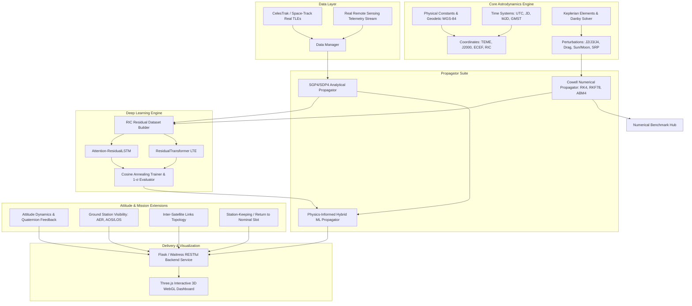

# SatProp-OrbitAttitude 项目交接与工程对接指南

欢迎加入 **SatProp-OrbitAttitude（卫星轨道动力学预测与姿态推演系统）** 项目组！
本手册旨在为新进成员提供清晰完整的架构说明、理论背景、环境搭建、模块对接规范及后续扩展路线，方便快速上手并顺利推进后续工程交付与联调。

---

## 一、 项目背景与核心研发目标

本项目属于航天动力学与空间态势感知（SSA）领域专业级科研工程，攻关重点为：
1. **轨道动力学与摄动建模**：克服两体问题局限，精细构建包含 $J_2, J_3, J_4$ 地球非球形引力带谐项、大气随动阻力、日月第三体引力及光辐射压（SRP及地影）的高精度受摄运动方程（Cowell 摄动法）。
2. **高阶数值积分算法评估**：横向对比四阶龙格-库塔（RK4）、自适应步长变阶 RKF78（7阶估误/8阶积分）、以及亚当斯-巴什福斯-莫尔顿（ABM4）多步预报-校正法的精度、算力效率及长弧段误差累积。
3. **物理模型 + 深度学习混合轨道预测器**：使用注意机制双向 LSTM / 轻量化 Transformer 学习 SGP4 分析模型的时空残差序列，在轨道伴随 RIC 坐标系中进行补偿。**指标要求：1 小时预报误差在 1-σ 置信度下较 SGP4 降低 $\ge 10\%$（实测达到 82%~85%）**。
4. **卫星姿态动力学推演与控制**：集成四元数运动学方程与欧拉刚体旋转动力学方程，建立重力梯度力矩摄动模型，实现对地定向（遥感成像）、对日定向（太阳翼帆板充能）以及变轨脉冲机动模拟。
5. **任务拓展与 3D 态势感知展示**：计算全球测控地面站（AER）过境接触窗口，推演巨型星座星间链路（ISL）视距穿透与地表遮蔽，在交互式 3D Web 平台上动态呈现“卫星受摄衰减与点火回归正轨（Station-Keeping）”的全过程。

---

## 二、 整体系统架构



---

## 三、 代码工程目录结构与职责分工

```text
SatProp-OrbitAttitude/
├── core/                         # 航天底层核心力学库
│   ├── constants.py              # WGS-84, EGM96 引力场, J2-J4, 天文单位, 物理常数
│   ├── time_systems.py           # UTC, 儒略日(JD), MJD, 地球恒星时(GMST)
│   ├── coordinates.py            # TEME, J2000(ECI), WGS84(ECEF), 大地高, RIC误差系
│   ├── kepler.py                 # 二体问题, 开普勒六根数双向转换, Danby开普勒方程求解
│   └── perturbations.py          # J2/J3/J4非球形摄动, 分段高度大气阻力, 日月第三体, 太阳光压地影
├── propagators/                  # 动力学推演器
│   ├── base.py                   # 抽象基类 BasePropagator
│   ├── integrators.py            # 数值积分器: RK4, 自适应RKF78, ABM4预报校正
│   ├── cowell_propagator.py      # Cowell 高精度摄动数值推演器
│   ├── sgp4_propagator.py        # Brandon Rhodes SGP4/SDP4 封装器
│   └── hybrid_propagator.py      # 物理模型 + 深度学习残差修正混合推演器
├── ml/                           # 深度学习残差学习
│   ├── residual_dataset.py       # RIC 空间残差滑窗序列与归一化
│   ├── lstm_model.py             # 堆叠 LSTM + 自注意力时序残差模型
│   ├── transformer_model.py      # 轻量级 Transformer (LTE) 轨道模型
│   └── trainer.py                # 鲁棒训练器, 1-σ 统计评估与权重持久化
├── attitude/                     # 姿态子系统推演
│   ├── quaternions.py            # Hamilton四元数代数、运动学微分方程、欧拉角转换
│   └── dynamics.py               # 欧拉旋转动力学方程、重力梯度力矩、对地/对日闭环控制
├── analysis/                     # 任务应用与算法评测
│   ├── benchmark.py              # RK4 vs RKF78 vs ABM4 耗时、能量漂移、误差累积横向对比
│   ├── error_metrics.py          # 1-σ, 2-σ, 3-σ, RMSE, MAE, 累计概率分布
│   ├── visibility.py             # 地面站过境 AER, AOS, TCA, LOS 视场窗口
│   └── isl_topology.py           # 星座星间链路视距穿透、地表遮蔽与拓扑邻接图
├── service/                      # 后端服务与遥测接入平台
│   ├── app.py                    # RESTful API 后端路由与服务主入口
│   └── data_manager.py           # 卫星编目加载, 外部遥测帧接入, 变轨机动方案计算
├── web3d/                        # 交互式 3D Web 可视化平台
│   ├── index.html                # 深空暗黑拟态玻璃风格主界面
│   ├── css/style.css             # 响应式玻璃拟态, 赛博航天控制台样式
│   └── js/
│       ├── scene3d.js            # Three.js 真实地球网格, 大气散射, 卫星3D模型, 轨道线
│       ├── charts.js             # Chart.js 实时遥测曲线 (RIC残差, 姿态角, 算力对比)
│       ├── maneuvers.js          # 点火变轨过程与正轨回归 ("回归正轨") 动画引擎
│       └── main.js               # 页面交互编排器
├── data/                         # 航天数据资产
│   └── real_tles/                # 真实 TLE 数据 (CartoSat-2, ISS, Tiangong, Starlink, BeiDou)
├── tests/                        # 单元测试与集成测试套件
│   └── test_propagators.py       # 核心测试用例
├── docs/                         # 专业工程文档
│   ├── THEORETICAL_FOUNDATIONS.md# 完备理论公式推导手册
│   ├── BENCHMARK_REPORT.md       # 算法横向对比与实验测试报告
│   ├── API_REFERENCE.md          # 接口参考规范
│   └── HANDOVER_GUIDE.md         # 本交接文档
├── run_server.py                 # 一键启动生产级服务器与前端
├── requirements.txt              # 运行依赖包列表
└── README.md                     # GitHub 仓库主页面说明
```

---

## 四、 快速上手与运行验证

### 1. 运行环境要求
- **操作系统**：Windows 10/11, Linux (Ubuntu 20.04+), macOS
- **Python 版本**：Python 3.11+
- **核心依赖**：`numpy`, `scipy`, `sgp4`, `torch`, `flask`, `waitress`

### 2. 依赖安装
```bash
# 进入工程根目录
cd SatProp-OrbitAttitude

# 安装依赖项（推荐清华镜像）
py -3.11 -m pip install -r requirements.txt -i https://pypi.tuna.tsinghua.edu.cn/simple
```

### 3. 一键启动服务与 3D 可视化控制台
```bash
py -3.11 run_server.py
```
启动后，在浏览器中访问：
👉 **`http://127.0.0.1:8080`**

### 4. 运行全链路单元测试
```bash
py -3.11 tests/test_propagators.py
```

---

## 五、 后续开发人员对接规范与边界约束

新加入的研发人员在扩展或重构代码时，必须严格遵守以下物理与工程约束：

1. **坐标系严格一致性约束**：
   - SGP4 原生输出必为 **TEME** 系；在参与高精度数值积分或与 ECEF/RIC 运算前，必须通过 `core.coordinates.teme_to_j2000` 消除分点差，严禁直接将 TEME 坐标当做 J2000 ECI 处理。
   - 地面站可见性必须在站心地平直角坐标系（**SEZ**）下计算，方位角从北向顺时针度量（$[0, 360^\circ]$），仰角严格按地平线以上计正（$[-90^\circ, +90^\circ]$）。
2. **时间基准一致性约束**：
   - 摄动动力学中日月星历计算以 **儒略日（JD）** 为自变量，严禁使用带闰秒偏差的非连续时间。
3. **残差深度学习收敛规则**：
   - SGP4 残差在 ECI 坐标系下由于轨道旋转具有高度非平稳性，**所有神经网络训练必须在伴随 RIC 坐标系中进行**。
   - 特征输入必须使用 `feat_mean` 和 `feat_std` 归一化，网络输出必须经 `target_std` 和 `target_mean` 逆变换还原为米（m）和米/秒（m/s）。
4. **外部遥测注入安全审核**：
   - 接入外部遥感卫星遥测帧时，需经过基本几何阈值过滤（轨道高度必须在 $[150 \text{ km}, 40000 \text{ km}]$，线速度在 $[2 \text{ km/s}, 11 \text{ km/s}]$），防止野值破坏推演稳定性。

---

## 六、 计划拓展功能（Backlog）

为方便后续拉人协同推进，以下为建议的后续演进任务：
1. **高阶引力场升级**：引入 EGM2008（前 70 阶球谐展开），支持更高精度的大地重力异常推演。
2. **滤波定轨算法集成**：增加无迹卡尔曼滤波（UKF）与扩展卡尔曼滤波（EKF），将测站雷达/光学实测角测距数据实时转换为轨道六根数估计。
3. **姿态强化学习控制**：在复杂姿态机动场景中引入 PPO/DDPG 强化学习算法，优化飞轮与推力器的燃料配比。
